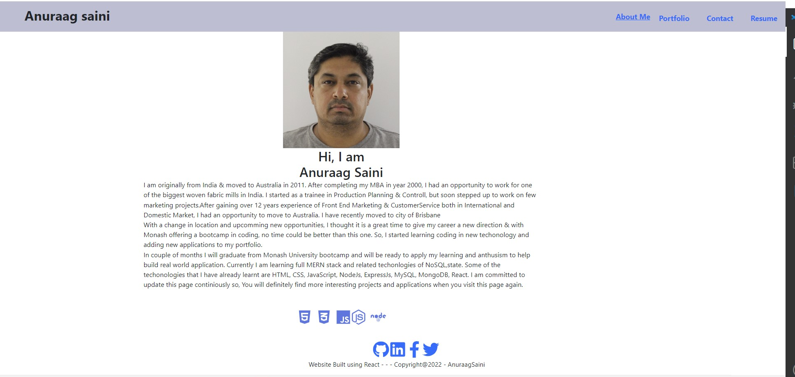

# MyPortfolio

This react page has been developed as a part of learning objective as well as showcasing my technical knowledge in using front end react for building web pages as well as some of the projectes and coding learnt by me in different web techonologies.

# Table of Contents
1. [Description](#Description)
2. [Get_Started](#Get_Started)
3. [Images](#Images)
4. [Techonology](#Techonology)
5. [Questions](#Questions)

## Description 
This web-page is a portfolio for Anuraag Saini, which includes some of the projects done by myself.

## Get Started
you will need to clone repository from https://github.com/Anu-Saini/MyPortfolio.git

The project depandencies can be downloaded via npm package manager using ```npm install``` command and the  package.json files includes the script to run the page ```npm run start```

## Images/Assets
The following images will depict the functionality of the web applicaton

### Home Page


## Techonology
The application has been built using the following techonologies and tools
React.js, custom styling


### Application  
The application has been hoisted on cloud by using a cloud service platform called Heroku. The link to the application is: https://myreactprofolio.herokuapp.com/


## Collaborators
This project is copyright @2022 AnuraagSaini and has been developed as a part o Anuraag Saini portfolio

## Question / inquireies / suggestions 
For questions can be directed to us at the below addresses:
github Username: Anu-Saini   <br>  
email: saini.anuraag@gmail.com


